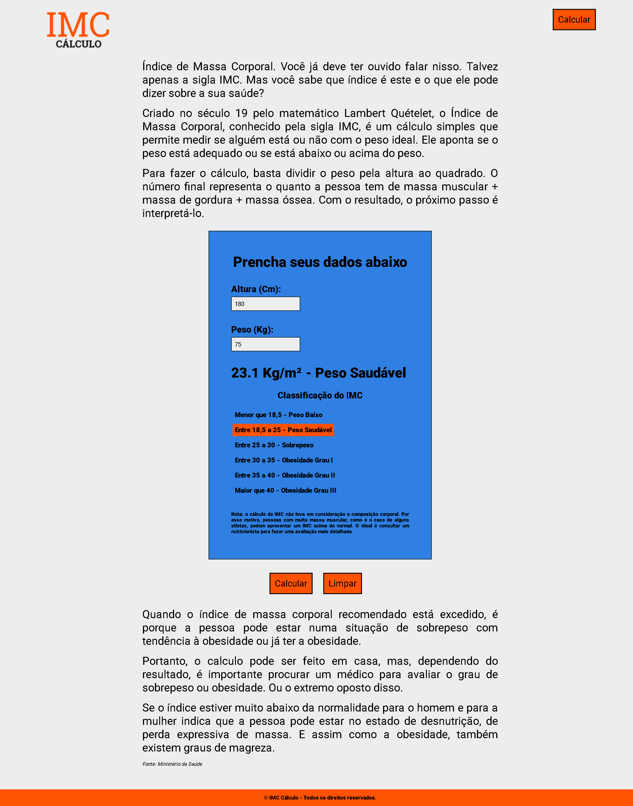
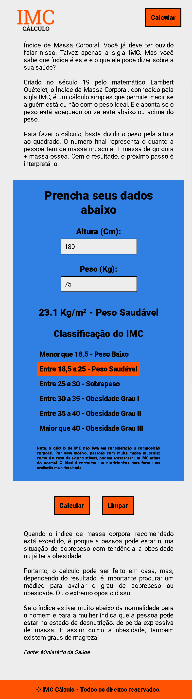

<h1>Calcular IMC</h1>

IMC ( Índice de Massa Corporal ) é um cálculo simples que permite medir se
  alguém está ou não com o peso ideal.  Projeto com o intuito de colocar em prática os conhecimentos adquiridos até
  aqui de JavaScript.

<nav>
  <a href="#desktop">Desktop</a>
  <a href="#mobile">Mobile</a>
  <a href="https://calcular-imc-rouge.vercel.app/" target="_blank">Projeto</a>
  <a href="#tecnologias">Tecnologias</a>
</nav>

<h2 id="desktop">Desktop</h2>

<h2 id="mobile">Mobile</h2>

<a href="https://calcular-imc-rouge.vercel.app/" target="_blank"><button>Ver Projeto</button></a>

<h2 id="tecnologias">Tecnologias</h2>
<ul>
  <li>HTML5</li>
  <li>CSS3</li>
  <li>JavaScript</li>
</ul>

<h4>
  Feito por <a href="https://www.linkedin.com/in/jrmartinsg/" target="_blank">jrmartinsg</a>
</h4>